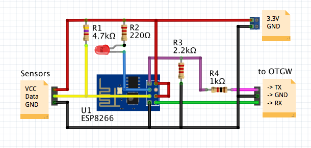

Update 2023-01-11: Added support to pull desired ventilation level from external web site. Added support for sending notification via web API.  Fixed also some bugs.

Arduino sketch for a ESP-8266 WiFi micro controller to control a Vitovent 300 
home ventilation unit via a OpenTherm Gateway and a WiFi connection.

Vitovent is a registered trademark held by the German manufacturer Viessman.
It is a device used for automatic home ventilation with heat recovery.
For more detail please check the manufacturer's page:
http://www.viessmann.de/de/wohngebaeude/wohnungslueftung/zentrale_wohnungslueftung/vitovent-300-w.html

The actual ventilation unit is communicating with the remote controller via a 
2-wire cable connection using the OpenTherm protocol. 
Since the controller has only very limited capabilities, I wanted more control 
over when to start/stop ventilation and at what throughput.
In particular, I wanted to adjust the fan stage automatically depending on the
air and weather conditions. For example, I want the fan to run at max speed only
if this is really necessary (CO2 level too high), wanted to stop it at summer 
time when it's already hot outside and still cool inside, run at higher levels
during the cool night hours or after a rain shower.    

The ESP does not communicate with the Vitovent directly. It needs a gateway that  
converts the voltage levels and protocol used between the controller and the unit
on the one hand and the ESP on the other hand via UART (RS232 with 3.3V voltage)
This gateway was designed by Schelte Bron (see http://otgw.tclcode.com) and is
called OTGW (OpenTherm Gateway).

The general setup looks as follows:

<pre>
[Controller] <-----OT-----> [OTGW] <------OT------> [VitoVent]
                               ^
                               | RS232 (* see WARNING2 below)      
                               |     
[WebBrowser] <----WiFi----> [ESP8666]  
</pre>

Using this sketch will allow you to collect the information that was intercepted by 
OTGW and to display it on any (mobile oder desktop) browser.
 
It will also allow to control the ventilation level resp. start/stop ventilation.
Provided you create a rule for this on your router, you could even control the unit
over the internet.

Besides reading and parsing the messages from the OTGW, the sketch implements also
reading the temperature of some DS18B290 temperature sensors attached to GPIO2 of the
ESP8266. This allows to monitor the temperature at the four air connections of the
unit (supply in/outlet & exhaust in/outlet). Although the VitoVent provides its own
measures for this, it does so however only on the inlet side (at least mine).  
 
<b>WARNING 1:</b> There is absolutely no access control implemented. Doing so means that 
virtually everybody can control your unit. You should assert a security policy 
by some other means then, e.g. with a web server that implements access restrictions
before proxying the request to the ESP running this sketch.

<b>WARNING 2:</b> The ESP is powered by 3.3V while the OTGW needs 5V. Also the logic levels
on the I/O pins are 0/3.3V and 0/5V. While some people say that the ESP is not 5V
tolerant, some say that this is a myth since the datasheets states that there is some
electronics to protect agains over voltage.
It's up to you to find out who is right and to risk to brick a ESP. 
For safe operation it is recommended to use a logic level shifter such as he AN10441 or 
PCA9306 or at least to use a voltage divider on the EPS's RX pin.

Note that the cables need to be crossed thus connecting Rx on the ESP side to Tx on the
gateway and vice versa.

GPIO0 - which is used during flashing the ESP (must be pulled to ground) - can be
connected to a LED and a resistor (approx. 200-30Ohms) towards Vcc (3.3V). 
It will be used as a heart beat to indicate this sketch is still operating and also
show the current fan speed by flashing at different speeds.   

GPIO2 can be used to attach one ore more temperature sensors. A 4k7 pullup must be
used between this pin and Vcc in this case:

